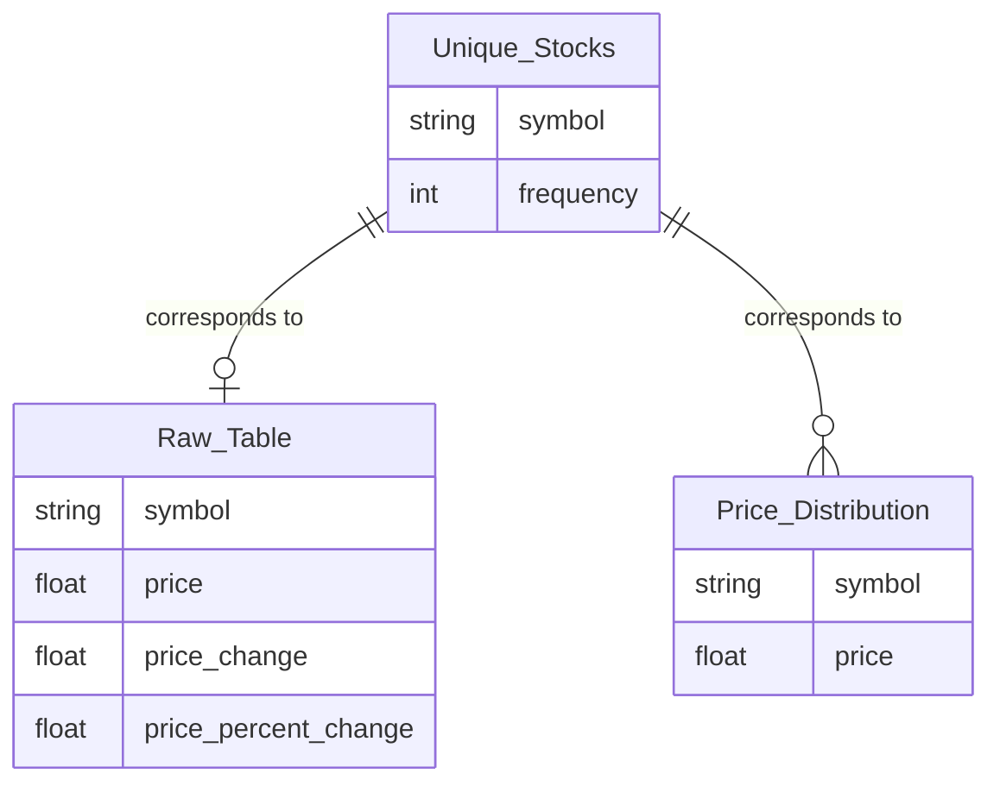

```mermaid
erDiagram
    Unique_Stocks ||--o| Raw_Table: "corresponds to"
    Unique_Stocks{
        string symbol
        int frequency
    }
    Raw_Table{
        string symbol
        float price
        float price_change
        float price_percent_change
    }
    Unique_Stocks||--o{Price_Distribution: "corresponds to"
    Price_Distribution{
        string symbol
        float price
    }
```
