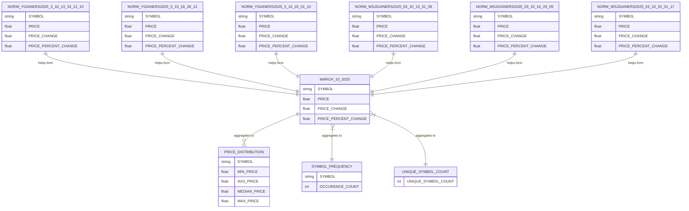

## Introduction

This report will outline the structure of the Snowflake database. The raw data represents stock data of gainer stocks collected three times a day for 5 days. Utilizing SQL and DBT Models new tables were formed to help answer our analysis questions. 

## Use Cases

**Use Case 1: Price Distribution**

In order to understand the price of gainers we calculate key statistics about their prices, such as minimum, average, median, and max price while on the gainer list. The `PRICE_DISTRIBUTION` table represents this data. The trading price of stock on `MARCH_10_2025` was between 2 and 745 dollars. The stock with the lowest `MAX_PRICE` was LCID and the stock with the highest was REGN.  

**Use Case 2: Frequency of Stock on the Gainer List**

Often we want to know if a stock has been consistently on the gainer list or if has only made the list a few times. Is the stock consistently growing or is it having a single moment of significant growth? This can be answered with the `SYMBOL_FREQUENCY` table, as it lists every stock in the `MARCH_10_2025` table with a frequency count of the number of times it made that list. There were three stocks that were listed for every instance of collection on `MARCH_10_2025`, they were VRN, PTGX, and WSC. While the list for the number of stocks that were listed for every instance was small, the list for the number of stocks that occurred only once is quite a bit longer at 139 stocks. 

**Use Case 3: Count How Many Stocks are on the Gainer Lists**

The table `UNIQUE_SYMBOL_COUNT` answers how many unique stocks occurred in the `MARCH_10_2025` table.

## Methods

**Data Collection**

This data was collected on an Ubuntu system utilizing a crontab file. The crontab file made use of a makefile which collects the data using Chrome stable headless browser to collect the HTML from the Wall Street Journal and Yahoo websites. 

**Data Processing**
   
The HTML was then converted into a csv file and normalized so data from the Wall Street Journal and Yahoo would contain the same features by utilizing python and pandas. 

**Data Ingestion**

The normalized csvs were uploaded from the Ubuntu system via DBT-core and DBT-snowflake into the cloud database within Snowflake.

**Data Defintion** 

New tables were created by utilizing the Snowflake worksheet to establish SQL that would perform as expected and then the SQL was added to a .sql file within the Ubuntu system. The new table in Snowflake would be formed once `dbt build` was called. 

## Summary

The Entity Relationship Diagram below helps us understand the structure of the database that is designed to gain better understanding of our stock data. Currently the data is only from the gainer lists from Wall Street Journal and Yahoo, but future analysis could include other stocks from the broader market. 

